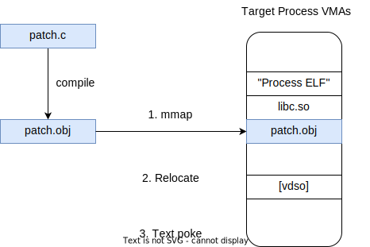

UPatch
========

# Introduction

UPatch is open source ELF tool. Based on [elfutils](https://sourceware.org/git/elfutils.git), [linenoise](https://github.com/antirez/linenoise) and [gtk](https://github.com/GNOME/gtk).


# Theroy

## Ftrace

Same as [linux](https://github.com/torvalds/linux) ftrace, need gcc `-pg` compile option.


## Upatch




# Code Style

* VIM

```bash
# .vimrc
set tabstop=4
set softtabstop=4
set shiftwidth=4
```

